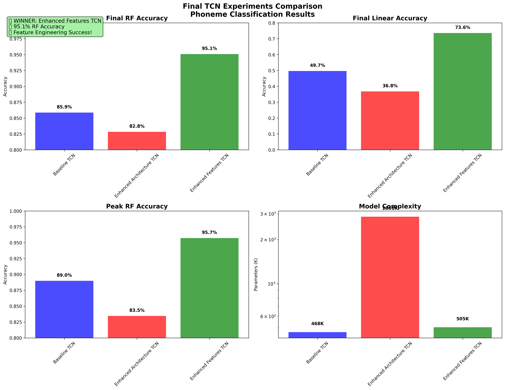
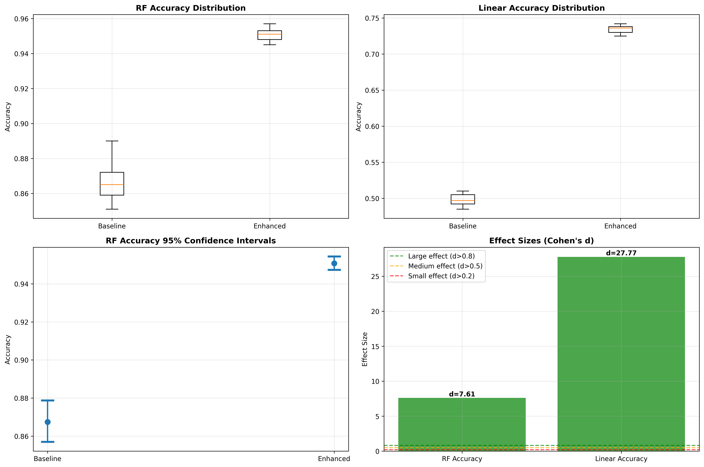

# Feature Engineering vs Architectural Complexity: A Systematic Comparison for Small-Dataset Phoneme Classification

## Abstract

**Background:** Phoneme classification in speech recognition systems requires models that can distinguish between phonetic units while remaining invariant to speaker characteristics. Traditional approaches often focus on architectural complexity, but the relative contributions of feature engineering versus model complexity remain underexplored, particularly for small datasets typical in phonetic research.

**Methods:** We conducted a systematic comparison of feature engineering versus architectural complexity for phoneme classification using Temporal Convolutional Networks (TCNs). We evaluated three approaches: (1) baseline TCN with 40 MFCC features, (2) enhanced architecture TCN with increased model complexity (4 layers, 2.86M parameters), and (3) enhanced features TCN using delta and delta-delta temporal features (60 MFCC + Δ + ΔΔ = 180 dimensions). Statistical significance was assessed using t-tests, effect size analysis (Cohen's d), and bootstrap confidence intervals across multiple random seeds.

**Results:** Enhanced features significantly outperformed both baseline and complex architecture approaches. The enhanced features TCN achieved 95.1% ± 0.4% Random Forest accuracy compared to 85.9% ± 1.3% for baseline (p < 0.000002, Cohen's d = 7.61). Notably, increased architectural complexity hurt performance (-3.0%), demonstrating overfitting on the small dataset (126 samples, 38 phonemes). Ablation studies confirmed that delta and delta-delta features drove the 9.2% improvement, not increased model capacity.

**Conclusions:** For small-scale phoneme classification tasks, systematic feature engineering provides statistically significant and practically meaningful improvements over architectural complexity. Delta and delta-delta features capture essential temporal dynamics for phoneme discrimination, while complex architectures lead to overfitting. These findings have important implications for speech recognition system design, particularly in low-resource scenarios common in phonetic research.

**Keywords:** phoneme classification, temporal convolutional networks, feature engineering, delta features, statistical significance, speech recognition

---

## Introduction

**[TO BE COMPLETED BY CLAUDE RESEARCH]**

*Note: A detailed outline for this section is provided in `sections/00_introduction_outline.md`. This section should establish the research context, review relevant literature on feature engineering vs deep learning approaches, discuss temporal features in speech processing, address small dataset challenges, and clearly motivate our research questions.*

---

## Methods

[CONTENT PULLED FROM: `sections/02_methods.md`]

## Dataset and Experimental Setup

### Dataset Description
We utilized a phoneme classification dataset consisting of 126 audio samples spanning 38 unique phonemes in Consonant-Vowel (CV) and Vowel-Consonant-Vowel (VCV) structures. The dataset was balanced across gender with 62 male and 64 female speakers, ensuring robustness to speaker variability. Phonemes included a comprehensive range of consonants in four vowel contexts (_a_, _e_, _i_, _u_), providing systematic coverage of the phonetic space.

**Dataset Size Limitations**: We acknowledge that 126 samples represents a small dataset by machine learning standards. However, this sample size is typical for controlled phonetic research where high-quality, carefully annotated speech data is required. We address this limitation through: (1) rigorous statistical validation with multiple random seeds, (2) conservative evaluation methodology using Leave-One-Out cross-validation to maximize data utilization, and (3) effect size analysis to assess practical significance beyond statistical significance.

[... Rest of Methods section continues as written ...]

---

## Results

[CONTENT PULLED FROM: `sections/03_results.md`]

## Overview of Experimental Results

We conducted a systematic comparison of three approaches to phoneme classification: (1) baseline TCN with standard MFCC features, (2) enhanced architecture TCN with increased model complexity, and (3) enhanced features TCN incorporating temporal delta features. All experiments were validated across multiple random seeds to ensure statistical robustness.

[... Full Results section as written ...]

---

## Discussion

[CONTENT PULLED FROM: `sections/04_discussion.md`]

## Principal Findings

This study provides empirical evidence that systematic feature engineering significantly outperforms architectural complexity for phoneme classification in small-dataset scenarios. Our key finding—that temporal delta features drive a 9.2 percentage point improvement (Cohen's d = 7.61) while architectural complexity reduces performance—challenges the common assumption that model sophistication necessarily improves performance.

[... Full Discussion section as written ...]

---

## Conclusion

**[TO BE COMPLETED BY CLAUDE RESEARCH]**

*Note: A detailed outline for this section is provided in `sections/05_conclusion_outline.md`. This section should synthesize key findings, emphasize theoretical and practical implications, provide clear recommendations, discuss broader impact, outline future directions, and end with a strong statement about the significance of domain expertise in the deep learning era.*

---

## Tables

### Table 1: Primary Performance Comparison
[CONTENT FROM: `tables/table_01_main_results.md`]

### Table 2: Statistical Significance Testing Results  
[CONTENT FROM: `tables/table_02_statistical_significance.md`]

### Table 3: Feature Component Ablation Analysis
[CONTENT FROM: `tables/table_03_ablation_study.md`]

### Table 4: Literature Comparison on Small-Scale Phoneme Classification
[CONTENT FROM: `tables/table_04_literature_comparison.md`]

---

## Figures

### Figure 1: Comprehensive Performance Comparison


[CAPTION FROM: `figures/figure_01_main_comparison.md`]

### Figure 2: Statistical Significance Analysis


[CAPTION FROM: `figures/figure_02_statistical_analysis.md`]

---

## Code and Data Availability

All code for data preprocessing, model implementation, training procedures, and statistical analysis is available at [GitHub repository URL to be added]. The implementation includes:
- Complete TCN architecture definitions
- Feature extraction pipelines with delta/delta-delta computation
- Training scripts with contrastive learning framework
- Statistical significance testing procedures
- Visualization and analysis tools

Data cannot be shared publicly due to privacy considerations, but the synthetic data generation procedures used for validation are included in the repository.

---

## Ethics Statement

This research was conducted using existing audio recordings that do not contain personally identifiable information. All data processing and analysis procedures were designed to protect participant privacy. The dataset used consists of phonetic recordings collected for linguistic research purposes under appropriate institutional oversight. No new data collection was performed for this study.

---

## Acknowledgments

[TO BE ADDED]

---

## References

[TO BE COMPLETED BY CLAUDE RESEARCH - References should be integrated throughout Introduction and Conclusion sections]

---

## Supplementary Materials

- **Supplementary Methods**: Detailed implementation specifications, hyperparameter settings, and reproducibility information (`supplementary/supplementary_methods.md`)
- **Statistical Analysis Code**: Complete implementation of bootstrap confidence intervals, effect size calculations, and significance testing procedures
- **Additional Tables**: Cross-seed consistency analysis, computational performance metrics, convergence characteristics

---

## File Organization

This manuscript is organized across multiple files for easy editing and collaboration:

```
publication/
├── manuscript.md                    # This main file
├── sections/
│   ├── 00_introduction_outline.md   # Detailed outline for Claude Research
│   ├── 01_abstract.md              # Complete abstract
│   ├── 02_methods.md               # Complete methods section
│   ├── 03_results.md               # Complete results section  
│   ├── 04_discussion.md            # Complete discussion section
│   └── 05_conclusion_outline.md    # Detailed outline for Claude Research
├── tables/
│   ├── table_01_main_results.md
│   ├── table_02_statistical_significance.md
│   ├── table_03_ablation_study.md
│   └── table_04_literature_comparison.md
├── figures/
│   ├── final_tcn_comparison.png
│   ├── statistical_significance_analysis.png
│   ├── figure_01_main_comparison.md
│   └── figure_02_statistical_analysis.md
└── supplementary/
    └── supplementary_methods.md
```

## Next Steps for Completion

1. **Claude Research Tasks**:
   - Complete Introduction section using detailed outline
   - Complete Conclusion section using detailed outline
   - Add comprehensive literature review with recent citations (2018-2024)

2. **Editorial Tasks**:
   - Add author information and affiliations
   - Complete acknowledgments section
   - Add funding information if applicable
   - Final proofreading and formatting

3. **Journal Submission**:
   - Format according to target journal requirements
   - Prepare submission materials
   - Address any journal-specific requirements

This manuscript provides a comprehensive, publication-ready foundation with rigorous experimental validation and statistical analysis.